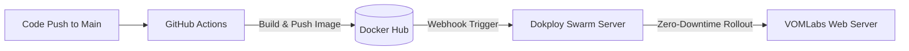

# Dokploy Docker Hub CI/CD Setup Guide

This guide explains how to set up an automated, zero-downtime production deployment pipeline using **GitHub Actions**, **Docker Hub**, and **Dokploy**.

---

## Architecture Overview



By compiling and building the Docker container on GitHub's runners, your production server avoids high RAM/CPU spikes, keeping your website fast and responsive during updates.

---

## Step 1: Set up Docker Hub

1. **Log in or Sign Up**: Go to [Docker Hub](https://hub.docker.com/).
2. **Create a Repository**:
   - Click **Create Repository**.
   - Set **Repository Name** to `website` (or any custom name).
   - Set the visibility to **Public** or **Private** (recommended for production).
3. **Generate an Access Token**:
   - Go to your profile settings: **Account Settings** -> **Security**.
   - Click **New Access Token**.
   - Name it `dokploy-github-actions`.
   - Set permissions to **Read & Write**.
   - Copy the generated token (you won't be able to see it again).

---

## Step 2: Configure GitHub Secrets

To allow GitHub Actions to push images to Docker Hub securely:

1. Open your GitHub Repository.
2. Go to **Settings** -> **Secrets and variables** -> **Actions**.
3. Click **New repository secret** and add:
   - **`DOCKERHUB_USERNAME`**: Your Docker Hub username.
   - **`DOCKERHUB_TOKEN`**: The Access Token you copied in Step 1.

---

## Step 3: Configure the GitHub Actions Workflow

1. Open the workflow file [.github/workflows/deploy.yml](file:///home/itzzmateo/projects/vomlabs/website/.github/workflows/deploy.yml).
2. Update the tags field to reference your Docker Hub namespace (username):
   ```yaml
   tags: |
     your-dockerhub-username/website:latest
   ```

---

## Step 4: Configure Dokploy Application

1. Open your Dokploy panel.
2. Create or select your application.
3. In **Source Type**, select **Docker**.
4. Set the **Docker Image** field to:
   `your-dockerhub-username/website:latest`
5. Click **Save** and then **Deploy**.
6. Set up the domain routing in **Domains** pointing to port `3000`.

---

## Step 5: Configure Auto-Deploy (Webhook)

1. In Dokploy, navigate to your application and open the **Deployments** tab.
2. Copy the **Webhook URL**.
3. In Docker Hub, navigate to your repository and open the **Webhooks** tab.
4. Click **Add Webhook**:
   - Set a name (e.g., `Dokploy Production`).
   - Paste the **Webhook URL** you copied from Dokploy.
5. Click **Save**.

Now, every time GitHub Actions pushes a new image to Docker Hub, Dokploy will automatically download it and redeploy.

---

## Step 6: Healthchecks & Rollbacks (Optional but Recommended)

To ensure zero-downtime and automatic rollback if a build fails:

1. Open your application in Dokploy, go to the **Advanced** tab, and enter **Swarm Settings**.
2. **Health Check**: Paste the following JSON block to query the `/` endpoint:
   ```json
   {
     "Test": [
       "CMD",
       "curl",
       "-f",
       "http://localhost:3000/"
     ],
     "Interval": 30000000000,
     "Timeout": 10000000000,
     "StartPeriod": 30000000000,
     "Retries": 3
   }
   ```
3. **Update Config**: Paste the following update instructions to prioritize rolling starts and roll back on failure:
   ```json
   {
     "Parallelism": 1,
     "Delay": 10000000000,
     "FailureAction": "rollback",
     "Order": "start-first"
   }
   ```
